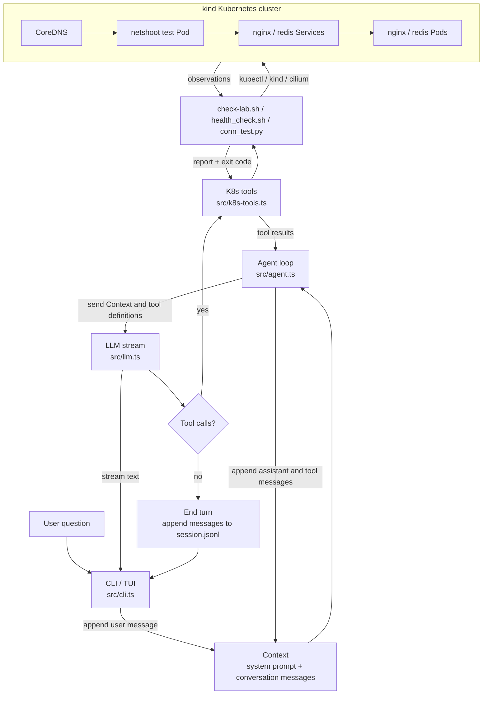

# Kubernetes SRE Toolkit

A lightweight collection of Bash utilities for validating Kubernetes networking, service connectivity, and common operational issues.

---

## Overview

This project provides small command-line tools for Kubernetes troubleshooting and SRE workflows.

Current components:

- ✅ **SRE Agent CLI** – Calls the checks below as read-only tools and explains their results.
- ✅ **Lab Check** – Validates the kind cluster, Cilium, workloads, endpoints, DNS, and baseline connectivity.
- ✅ **Health Check** – Validate Service health from both the Kubernetes control plane and the data plane.
- ✅ **Connectivity Matrix** – Compare HTTP, TCP, and DNS results with the expected flows in `checks/connectivity.json`.
- 🚧 **Incident Detector** – Detect common networking and configuration issues.

---

## Agent CLI

The TypeScript agent CLI requires Node.js 22.9 or newer and an OpenAI-compatible chat completions endpoint. Install dependencies and build it with:

```bash
npm ci
npm run build
```

Copy the example configuration to `.env`, then replace its placeholder values with settings from the same provider. In PowerShell:

```powershell
Copy-Item .env.example .env
# Edit .env to set MINIPI_API_KEY, MINIPI_MODEL, and MINIPI_BASE_URL.
npm start
```

`npm start` loads `.env` when it exists. Use `npm run dev` to build and start in one command. Conversation messages are saved in `~/.minipi/session.jsonl`.

The CLI is a read-only K8s check agent. For example, ask “检查 sre-lab 的健康状况” or “为什么 nginx Service 不通？”. It can call:

| Agent tool | Existing check | Purpose |
| --- | --- | --- |
| `check_k8s_lab` | `checks/check-lab.sh` | Cluster and lab baseline |
| `check_k8s_services` | `checks/health_check.sh` | Pod readiness, endpoints, Service TCP |
| `check_k8s_connectivity` | `checks/conn_test.py` | Expected HTTP, TCP, and DNS flows |

Flow: **user question → agent selects check → check runs `kubectl` → report returns to agent → agent explains the evidence**. Checks use your current `kubectl` context; verify it points to the intended cluster before running them. The agent cannot change cluster resources. It reports possible causes as hypotheses until a check confirms them.

On Windows, the CLI looks for Git Bash next to `git.exe` on `PATH`. Set `SRE_BASH` to a Bash executable if it is elsewhere. Set `SRE_PYTHON` if the Python executable is not named `python`. Bash, Python 3, `kubectl`, and access to the lab cluster are required for all checks.

---

## Features

### Health Check

The health check validates every Service in a namespace by performing:

- Discover Services
- Find backing Pods using the Service selector
- Verify all Pods are Ready
- Verify the Service has Endpoints
- Test TCP connectivity from a test Pod (`netshoot`)
- Generate a JSON health report

```bash
./checks/health_check.sh <namespace>
```

Example:

```bash
./checks/health_check.sh sre-lab
```

---

### Connectivity Matrix

Verify expected network connectivity against the live Kubernetes cluster.

Features:

- Read connectivity tests from a JSON specification
- Execute TCP (`nc`), HTTP (`curl`), and DNS (`nslookup`) checks from a source Pod
- Compare actual connectivity with expected results
- Generate structured JSON reports and return appropriate exit codes

Run the connectivity tests with:

```bash
python3 checks/conn_test.py checks/connectivity.json
```

On Windows, you may need to use:

```bash
python checks/conn_test.py checks/connectivity.json
```

The command exits with:

- `0` when all actual results match expectations
- `1` when one or more tests do not match expectations
- `2` when the specification or command arguments are invalid

---

### Incident Detector _(Coming Soon)_

Automatically detect common Kubernetes networking failures.

Planned checks:

- Missing Endpoints
- Pod Not Ready
- DNS failures
- Service port mismatch
- NetworkPolicy blocking
- ImagePullBackOff / CrashLoopBackOff

---

## Architecture



When the model requests a check, the agent executes the tool and adds its result to Context. It then calls the model again with the updated Context. This repeats until the model returns without tool calls; the CLI saves the turn and waits for the next question. The checks observe the cluster through `kubectl` and return evidence for the agent to explain.

---

## Prerequisites

- Docker
- kind
- kubectl
- k9s (optional)

Verify the cluster is reachable.

```bash
kubectl get nodes
```

## Setup

Make the scripts executable.

```bash
chmod +x checks/*.sh lab/setup.sh
```

Create the demo topology.

```bash
./lab/setup.sh
```

Validate the environment.

```bash
./checks/check-lab.sh
```

---

## Usage

### Health Check

Run against a namespace:

```bash
./checks/health_check.sh <namespace>
```

Example:

```bash
./checks/health_check.sh sre-lab
```

---

### Connectivity Matrix

```bash
python3 checks/conn_test.py checks/connectivity.json
```

---

### Incident Detector _(Coming Soon)_

There is no standalone incident detector yet. The agent can explain failures from the existing checks, but it does not implement root-cause detection or automated repair.

---

## Example Output

```json
[
  {
    "service": "nginx",
    "namespace": "sre-lab",
    "healthy": true,
    "endpoints": 2,
    "reason": "ok"
  },
  {
    "service": "redis",
    "namespace": "sre-lab",
    "healthy": true,
    "endpoints": 1,
    "reason": "ok"
  }
]
```

Exit codes:

| Code | Meaning                          |
| ---- | -------------------------------- |
| 0    | All Services are healthy         |
| 1    | One or more health checks failed |
| 2    | Invalid arguments or environment |

---

## Troubleshooting

| Reason               | Description                                                                       |
| -------------------- | --------------------------------------------------------------------------------- |
| `no backing pods`    | The Service selector does not match any Pods.                                     |
| `not ready`          | One or more backend Pods are not Ready.                                           |
| `no endpoints`       | The Service has no Ready Endpoints.                                               |
| `connection refused` | The Service is reachable but the application is not listening on the target port. |
| `timeout`            | DNS, NetworkPolicy, or routing prevented the TCP connection.                      |

---

## Roadmap

- [x] Health Check
- [x] Connectivity Matrix and agent check tools
- [ ] Incident Detector
- [ ] JSON Schema documentation
- [ ] GitHub Actions integration
