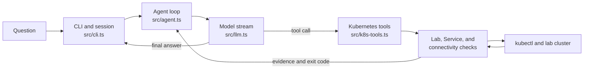

# Kubernetes Agent Learning Lab

A hands-on project for learning how a minimal AI agent loop works and using it to investigate Kubernetes problems in a local `kind` cluster.

The TypeScript agent is **inspired by [Pi](https://github.com/earendil-works/pi)**. It implements its own small loop for streaming model output, calling tools, recording results, and continuing the conversation. It does not install or depend on Pi packages. The Kubernetes lab gives that loop a concrete task: run checks and explain the evidence behind Service, DNS, and connectivity failures.

## What you can learn

- **Agent mechanics:** conversation context, streaming responses, tool calls, tool results, and session persistence.
- **Kubernetes troubleshooting:** Pod readiness, Service selectors and endpoints, DNS, TCP/HTTP connectivity, and NetworkPolicy behavior.
- **Evidence over guesses:** distinguish a failed check from a confirmed root cause.

The CLI exposes three Kubernetes check tools. It can inspect cluster state through the scripts below; it cannot change Kubernetes resources or repair an incident. The separate lab setup and incident manifests **do** change the local cluster when you run them.

## Quick start

### Prerequisites

- Node.js 22.9 or newer and npm
- Docker, `kind`, `kubectl`, and the Cilium CLI (`cilium`)
- Bash and Python 3
- An API key for an OpenAI-compatible chat completions endpoint that supports tool calls

The lab setup creates a `kind` cluster named `sre-lab`, installs Cilium, and deploys the `sre-lab` namespace with nginx, Redis, a Redis client, and a `netshoot` test Pod. Run these commands from the repository root in a Bash shell:

```bash
npm ci
npm run build
cp .env.example .env
# Edit .env: set MINIPI_API_KEY, MINIPI_MODEL, and MINIPI_BASE_URL.
bash lab/setup.sh
kubectl config current-context   # Expect kind-sre-lab.
bash checks/check-lab.sh
npm start
```

On Windows, Git Bash can run the Bash commands. If you use PowerShell for the Node commands, copy the configuration file with `Copy-Item .env.example .env`. The CLI looks for Git Bash next to `git.exe` on `PATH`; set `SRE_BASH` to its executable path if needed. Set `SRE_PYTHON` if your Python 3 executable is not named `python` on Windows or `python3` elsewhere.

Before rerunning setup or applying an incident manifest, confirm that `kubectl config current-context` points to `kind-sre-lab`. The check tools use the current `kubectl` context.

Try asking the CLI:

```text
检查 sre-lab 的健康状况
为什么 nginx Service 不通？
检查 DNS 和网络连通性
```

The conversation is appended to `~/.minipi/session.jsonl` and loaded on the next start. The `.env` file is ignored by Git; keep your API key there rather than in a commit.

## How the agent works



The loop sends the conversation and tool definitions to the model. When the model requests a check, the CLI runs the corresponding script, adds its result to the conversation, and calls the model again. The turn ends when the model responds without another tool call.

| Read this file | To understand |
| --- | --- |
| `src/cli.ts` | Model configuration, tool registration, and saved conversations |
| `src/agent.ts` | The minimal model → tool → model loop |
| `src/llm.ts` | Streaming an OpenAI-compatible response and mapping tool calls |
| `src/k8s-tools.ts` | How the three Kubernetes checks become agent tools |
| `src/tui.ts` | Terminal input, streamed output, and interruption |
| `checks/` | The Kubernetes observations returned to the agent |

`src/tools.ts` contains generic file and shell tool examples for studying agent tooling. The Kubernetes CLI does **not** register those tools; it registers only the three checks below.

## Kubernetes checks

| Agent tool | Standalone command | What it checks |
| --- | --- | --- |
| `check_k8s_lab` | `bash checks/check-lab.sh` | The `sre-lab` baseline: cluster, nodes, Cilium, workloads, endpoints, DNS, and connectivity |
| `check_k8s_services` | `bash checks/health_check.sh sre-lab` | Service backing Pods, readiness, endpoints, and TCP access from `netshoot` |
| `check_k8s_connectivity` | `python3 checks/conn_test.py checks/connectivity.json` | Expected HTTP, TCP, and DNS flows from the checked-in specification |

The Service health check accepts a namespace argument; the lab baseline and checked-in connectivity specification target `sre-lab`. On Windows, use `python` instead of `python3` if that is the name of your Python executable.

The Service and connectivity checks emit JSON reports. For Service health, exit code `0` means all checked Services passed, `1` means at least one failed, and `2` means the arguments or environment were invalid. For the connectivity matrix, `0` means observed results matched expectations, `1` means a mismatch, and `2` means invalid input or arguments. The lab check prints a human-readable summary and returns a nonzero code when baseline checks fail.

## Try a failure

After the baseline passes, open a second terminal and intentionally break the nginx Service port:

```bash
kubectl apply -f lab/manifests/incidents/incident-01-nginx-service-broken.yaml
```

Ask the running agent `为什么 nginx Service 不通？` and compare its tool result with `bash checks/health_check.sh sre-lab`. The check can establish that TCP access failed; the proposed cause remains a hypothesis until you inspect the Service configuration. Restore the baseline afterward:

```bash
kubectl apply -f lab/manifests/nginx.yaml
```

Other exercise manifests are in `lab/manifests/incidents/`. Apply them one at a time, then restore the corresponding baseline manifest or remove the added resource.

## Current scope

This is a learning lab, not a production incident response system. The CLI uses the current kubeconfig context, runs predefined checks, and explains their output. There is no standalone incident detector, automatic root-cause proof, or automated repair. A failed or unavailable check should be treated as evidence to investigate, not as a complete diagnosis.

## Roadmap

- [x] Minimal agent loop and Kubernetes check tools
- [x] Service health and connectivity matrix
- [ ] Standalone incident detector
- [ ] JSON Schema documentation
- [ ] GitHub Actions integration
